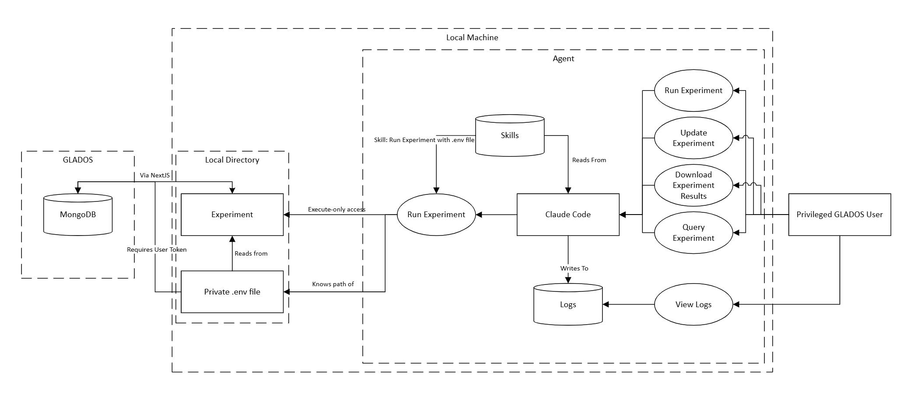

# Agentic Threat Modeling

GLADOS is currently working on supporting an agentic workflow. Security is a paramount concern for a system that currently operates under a full trust model. This is the threat modeling the 2025-2026 team was able to get done so far:

The following must be true about the new system:
 - A user's GLADOS token must be required for operations with Claude Code.
 - The agent must not have read or write permissions to any experiment files - only execute permissions.
 - A persistent log must be kept for all user-agent interactions and all tasks the agent runs.
    - It should not be possible to change any old log entries.
 - The agent should provide the script with environment variables and a token as specified by a .env file. However, the agent should not be able to read or write to this file.
 - The agent should have a rate limit to prevent an agent from submitting too many experiments and thus causing a denial of service attack to occur.
 - This agentic workflow should only be accessible to users with privileged status - at least for now.